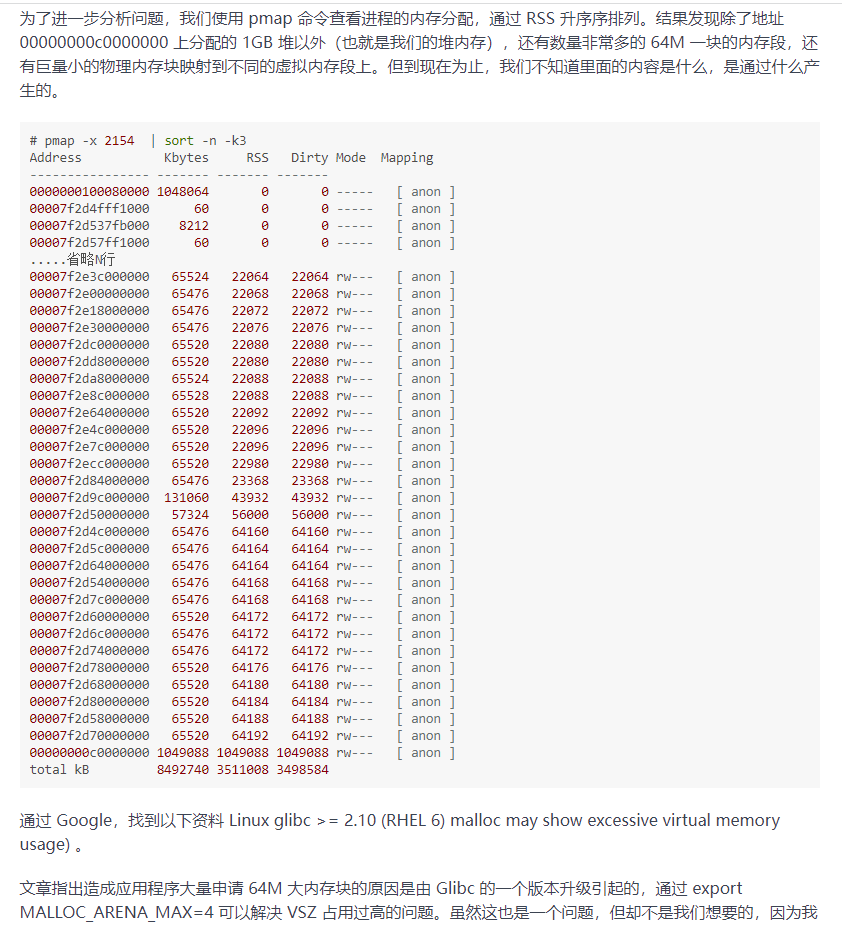
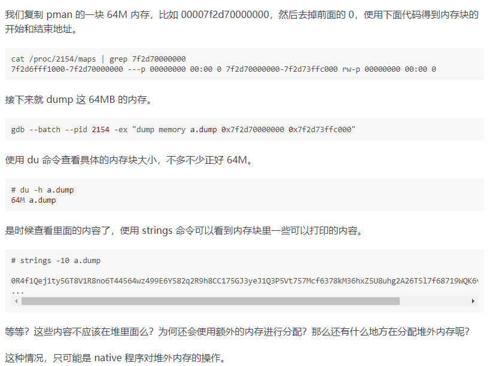

## OOM排查：

写在前面：当发生OOM时：

1. GC 线程会造成 CPU 飙升，所以此时jstack是一个分析入口，所以面试的时候被问发生CPU飙升的情况不止发生死循环、死锁，OOM应该是被最先回答的（笔者这里吃过亏）
2. 其次才是分析OOM发生的区域

### heap溢出

-Xms -Xmx

大部分对象都在这里完成自己的 “life cycle”

与GC Roots 强关联性（这里一般coding的过程中都是强引用，如果系统内部有使用JVM本地内存的cache模块，比如@EnableCaching，建议使用弱引用级别，来避免GC次数）

这里其实大部分业务情况都会遇到，笔者无需自己提出场景


### metaspace溢出

-XX:MetaspaceSize

-XX:MaxMetaspaceSize

可能会出现的场景：主要是由于加载的类太多，或者动态代理生成的类太多（反射生成类、第三方类库风险，spring全家桶系列，自动装配）。

 for safe，首先设置一个上限，这里就需要你自己根据你的业务情况来选择一个合适的值了。

假如你把堆 Metaspace 的限制给去掉，它占用的内存会一直增长，并且占用本机的物理内存。

metaspace空间严格来说也属于堆外内存。

场景：自己围绕着动态代理这个点来输出关联性业务即可。


### 堆外内存溢出

[堆外内存排查链接](https://learn.lianglianglee.com/%E4%B8%93%E6%A0%8F/%E6%B7%B1%E5%85%A5%E6%B5%85%E5%87%BA%20Java%20%E8%99%9A%E6%8B%9F%E6%9C%BA-%E5%AE%8C/14%20%E5%8A%A8%E6%89%8B%E5%AE%9E%E8%B7%B5%EF%BC%9A%E8%AE%A9%E9%9D%A2%E8%AF%95%E5%AE%98%E5%88%AE%E7%9B%AE%E7%9B%B8%E7%9C%8B%E7%9A%84%E5%A0%86%E5%A4%96%E5%86%85%E5%AD%98%E6%8E%92%E6%9F%A5.md)




曾经我有一次遇到top命令查看某个java服务运行超过给定的Xmx的阈值，导致物理机器内存爆了，一直OOM分析到堆外内存溢出，然后分析这里，发现到虚拟内存一直在开辟64M的空间

后来把一块64M的内存空间dump出来看




场景：这个是由于一个业务需要频繁的 zip unzip，通过java使用 java.util.zip.GZIPInputStream 类中调用的 libzip.so 库，这块操作全部是由native的方法申请的堆外内存导致。


### 栈溢出

-Xss128K 参数可以设置它的大小，128K是一个比较合理的值

属于每个线程，这里很重要，围绕着线程私有的划分区域来回答

场景：此情况较少，一般不会遇到且是coding错误，笔者上一次遇到是因为在写递归调用本身，出口写错了。


### 进程异常退出

现象：**我的 Java 进程没了，什么都没留下，直接蒸发不见了**


这个现象，其实和 Linux 的内存管理有关。由于 Linux 系统采用的是虚拟内存分配方式，JVM 的代码、库、堆和栈的使用都会消耗内存，但是申请出来的内存，只要没真正 access过，是不算的，因为没有真正为之分配物理页面。

随着使用内存越用越多。第一层防护墙就是 SWAP；当 SWAP 也用的差不多了，会尝试释放 cache；当这两者资源都耗尽，杀手就出现了。oom-killer 会在系统内存耗尽的情况下跳出来，选择性的干掉一些进程以求释放一点内存。

所以这时候我们的 Java 进程，是操作系统“主动”终结的，JVM 连发表遗言的机会都没有。这个信息，只能在操作系统日志里查找，通过dmesg 命令。

要解决这种问题，首先不能太贪婪。比如一共 8GB 的机器，你把整整 7.5GB 都分配给了 JVM。当操作系统内存不足时，你的 JVM 就可能成为 oom-killer 的猎物。


dmesg 命令（-T 加上时间）：这个命令是输出 kernel 的 log，找关键字 “java” 相关的进程是否被干掉了

swap的作用：个人理解，宁愿让整个linux维持的连接少一点，都不让linux用磁盘来变慢响应


通常，我们在关闭服务的时候，会使用“kill -15”，而不是“kill -9”


## 内存泄漏：

[内存泄漏链接](https://learn.lianglianglee.com/%E4%B8%93%E6%A0%8F/%E6%B7%B1%E5%85%A5%E6%B5%85%E5%87%BA%20Java%20%E8%99%9A%E6%8B%9F%E6%9C%BA-%E5%AE%8C/12%20%E7%AC%AC11%E8%AE%B2%EF%BC%9A%E5%8A%A8%E6%89%8B%E5%AE%9E%E8%B7%B5%EF%BC%9A%E9%81%87%E5%88%B0%E9%97%AE%E9%A2%98%E4%B8%8D%E8%A6%81%E6%85%8C%EF%BC%8C%E8%BD%BB%E6%9D%BE%E6%90%9E%E5%AE%9A%E5%86%85%E5%AD%98%E6%B3%84%E6%BC%8F.md)

在 Linux 上，分析哪个线程引起的 CPU 问题，通常有一个固定的步骤

（1）使用 top 命令，查找到使用 CPU 最多的某个进程，记录它的 pid。使用 Shift + P 快捷键可以按 CPU 的使用率进行排序。

```css
top
```

（2）再次使用 top 命令，加 -H 参数，查看某个进程中使用 CPU 最多的某个线程，记录线程的 ID。

```bash
top -Hp $pid
```

（3）使用 printf 函数，将十进制的 tid 转化成十六进制。

```perl
printf %x $tid
```

（4）使用 jstack 命令，查看 Java 进程的线程栈。

```bash
jstack $pid >$pid.log
```

（5）使用 less 命令查看生成的文件，并查找刚才转化的十六进制 tid，找到发生问题的线程上下文。

```bash
less $pid.log
```

（6）把内存 dump 一份下来，使用 MAT 等工具分析具体原因。


内存泄漏本质上是  **不再被使用的对象、没有被回收、没有及时切断与 GC Roots 的联系**


表现形式：通过分析dump文件，发现 Old 区的占用持续上升，即使经过了多轮 GC 也没有明显改善。


一个经常发生的内存泄漏的例子，也是由于 HashMap 产生的。由于没有重写 Key 类的 hashCode 和 equals 方法，造成了放入 HashMap 的所有对象都无法被取出来，它们就无法被GC。

还有一个例子，使用 String 的 intern 方法，但如果字符串本身是一个非常长的字符串，而且创建之后不再被使用，也会造成内存泄漏。
